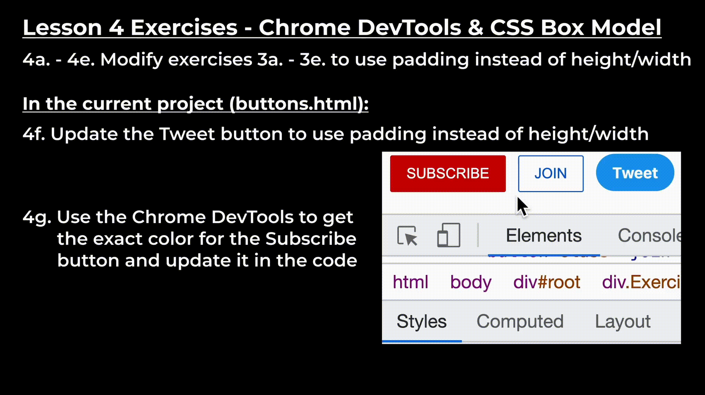
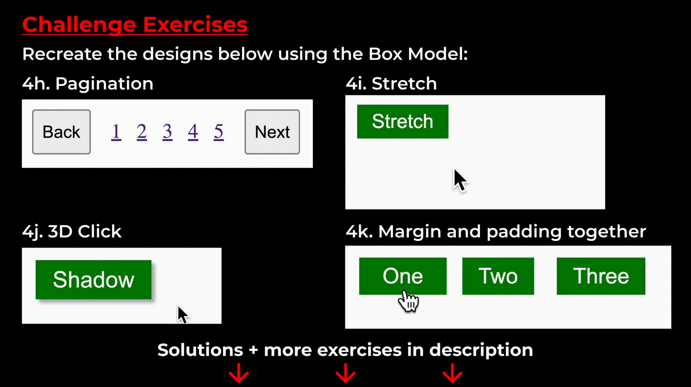

# Exercises - Lesson 4: Chrome DevTools & CSS Box Model

## 4a. - 4e. Modify exercises 3a. - 3e. to use padding instead of height/width

## In the current project (buttons.html)
## 4f. Update the Tweet button to use padding instead of height/width

## 4g. Use the Chrome DevTools to get the exact color for the Subscribe button and update it in the code

## **Challenge Exercises**

Recreate designs below using the Box Model:

## 4h. Pagination

## 4i. Stretch

## 4j. 3D Click

## 4k. Margin and padding together