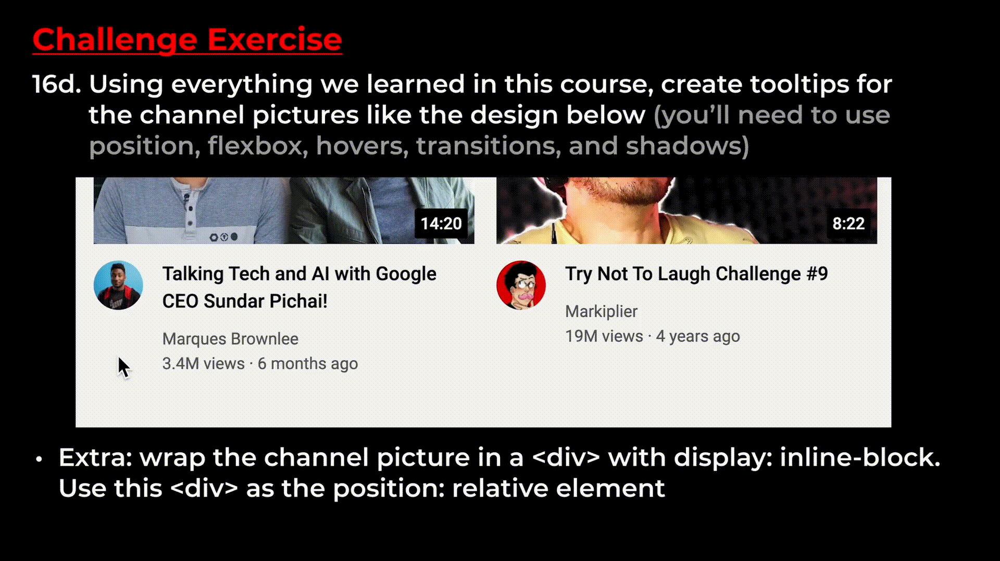

# Exercises - Lesson 16: Finish the Project

## 16a. Add the remaining tooltips in the header

## 16b. Make the video title a link to the actual YouTube video (you can click the video titles in the final design to get the URL)

## 16c. Turn the video thumbnails and channel pictures into links (wrap the `` in an `<a>` element)

## Challenge Exercise

## 16d. Using everything we learned in this course, create tooltips for the channel pictures like the design below 
- Extra: Wrap the channel picture in a `
` with `display: inline-block`. Use the `
` as the `position: relative` element